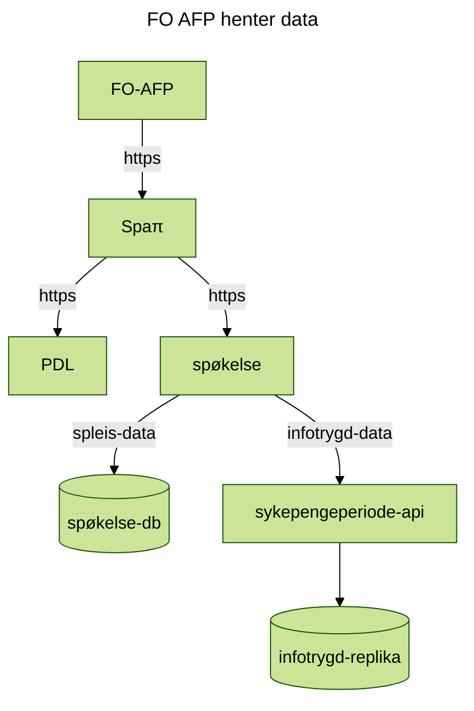
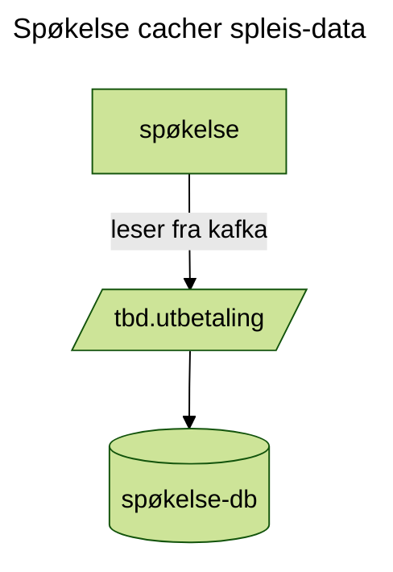
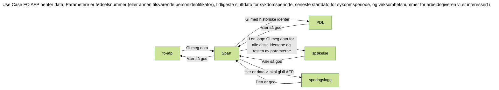
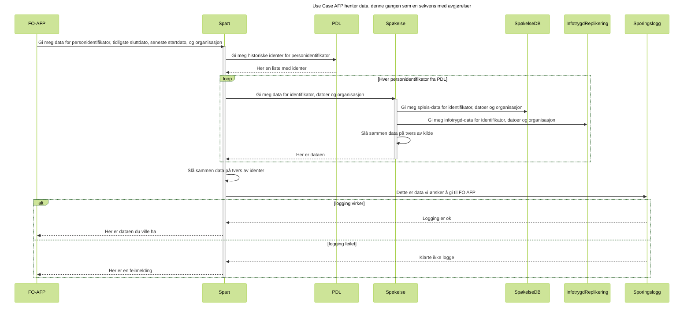

Spaπ eksponerer sykepengeperioder til eksterne konsumenter.

I første omgang deles dette med privat og offentlig AFP.

---
Overordnet systemarkitekturskisse
---

# API-definisjon
[Swagger Test](https://spapi.ekstern.dev.nav.no/swagger)

[Swagger Produksjon](https://spapi.nav.no/swagger)