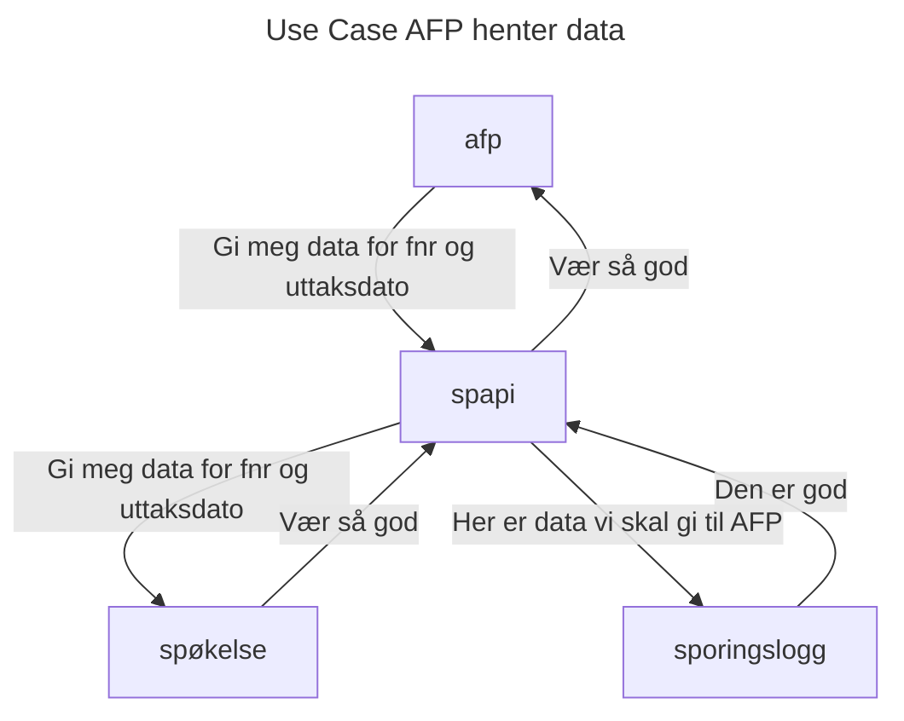

SPAPI eksponerer sykepengeperioder til eksterne konsumenter.

I første omgang er dette kun Fellesordningen for AFP.

---
Overordnet systemarkitekturskisse
---

# API-definisjon

I påvente av at vi lager en swagger-greie eller tilsvarende

Request:
POST
parametere er fnr (11 siffer) og dato

Response: 
JSON-objekt som inneholder et resultat som er en liste med fom (dato), tom(dato) og grad (heltall)

Alle datoer er på format `yyyy-mm-dd`